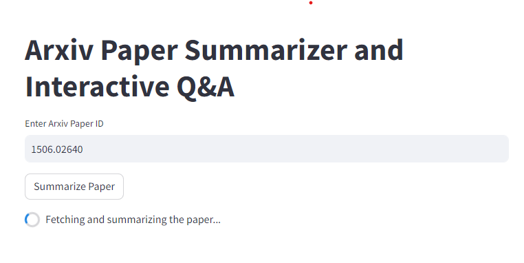
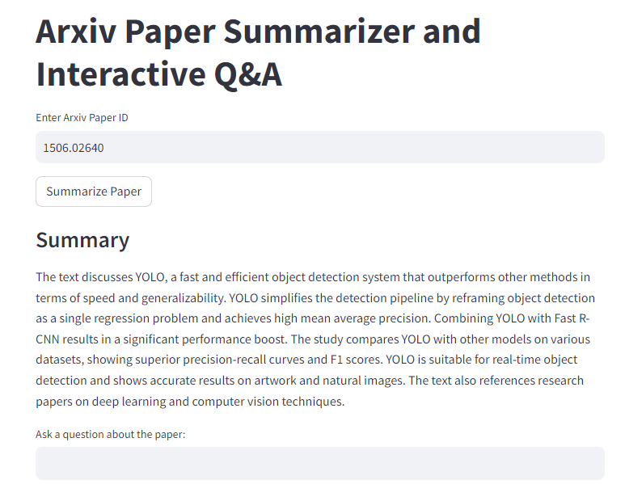
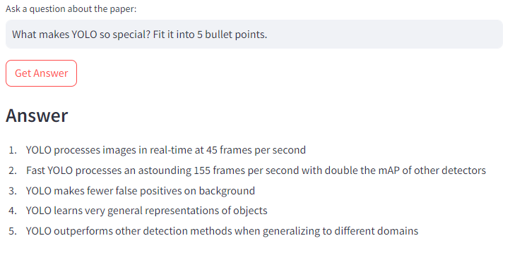

# Article Summarization and Question Answering

This project had an aim to familarize with Streamilt possibilities as well as to test out Pinecone database and OpenAI API.

##  Functionality

The Streamlit app gets the ID of the paper which is presented on Arxiv. Then by clicking "Summarize paper" the summary apopears. After the summary you can asq questions for the paper. The data is stored in the Pinecone index.

## Text summarization

In order to read the paper the `ArxivLoader` by `langchain_community` is used. After paper is read (the function is presented in the test.ipynb as well as in the utils.py) it gets separated into chunks with chunk size 800 and overlap of 50 characters. This allows to separate document into relatively huge chunks. The chunks should be larger when it comes to large documents. For the summarization the MapReduce type of chain is used. It creates summary for each chunk of the text and then prints out the final summary which is a summarizes chunk summary.

## Question Answering

For the question answering the same chunks from the previous stage are used. This chunks got embedded by `OpenAIEmbeddings` and then after initiazlizing the index, data is written to the Pinecone vector database. After this is done the similarity search is performed in the database and then this data gets processed by `gpt-3.5-turbo-0125` which retrieves an answer.

## Special thanks

Big thanks to Krish Naik and his [YouTube](https://www.youtube.com/@krishnaik06) channel!

